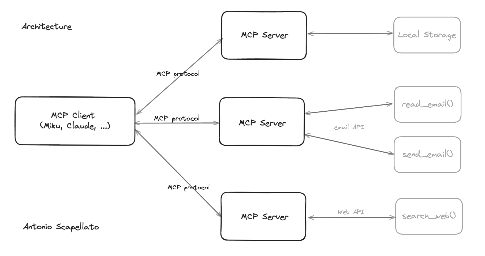

# MCP Sample Stack

This repository contains an implementation of a Model Context Protocol (MCP) server for educational purposes. This code demonstrates how to build a functional MCP server that can integrate with various LLM clients.

# MCP Server Example

This repository contains an implementation of a Model Context Protocol (MCP) server for educational purposes. This code demonstrates how to build a functional MCP server that can integrate with various LLM clients.

References: 
- [Model Context Protocol - Anthropic](https://modelcontextprotocol.io/).
- [MCP - Python](https://pypi.org/project/mcp/).

## What is MCP?

MCP (Model Context Protocol) is an open protocol that standardizes how applications provide context to LLMs. Think of MCP like a USB-C port for AI applications - it provides a standardized way to connect AI models to different data sources and tools.

### Key Benefits

- A growing list of pre-built integrations that your LLM can directly plug into
- Flexibility to switch between LLM providers and vendors
- Best practices for securing your data within your infrastructure

## Architecture Overview

MCP follows a client-server architecture where a host application can connect to multiple servers:

- **MCP Hosts**: Programs like Claude Desktop, IDEs, or AI tools that want to access data through MCP
- **MCP Clients**: Protocol clients that maintain 1:1 connections with servers
- **MCP Servers**: Lightweight programs that expose specific capabilities through the standardized Model Context Protocol
- **Data Sources**: Both local (files, databases) and remote services (APIs) that MCP servers can access

## Core MCP Concepts

MCP servers can provide three main types of capabilities:

- **Resources**: File-like data that can be read by clients (like API responses or file contents)
- **Tools**: Functions that can be called by the LLM (with user approval)
- **Prompts**: Pre-written templates that help users accomplish specific tasks

## System Requirements

- Python 3.10 or higher
- MCP SDK 1.2.0 or higher
- `uv` package manager

Made with ❤️ by [Antonio Scapellato](https://scapellato.dev)

---

## License

This project is licensed under the MIT License. See the [LICENSE](LICENSE) file for details.